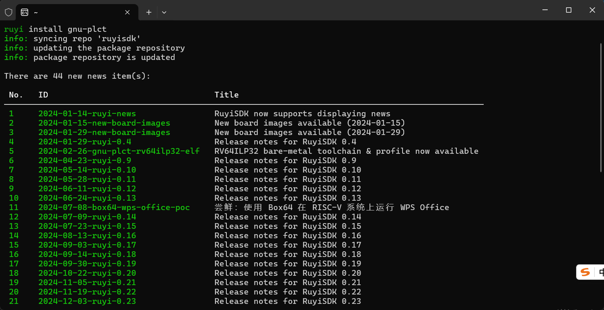
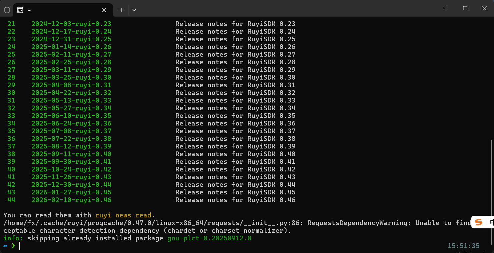
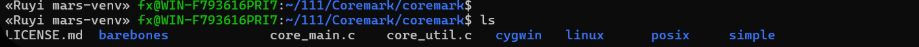
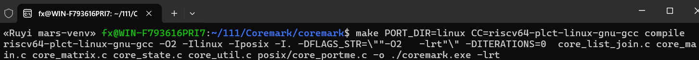
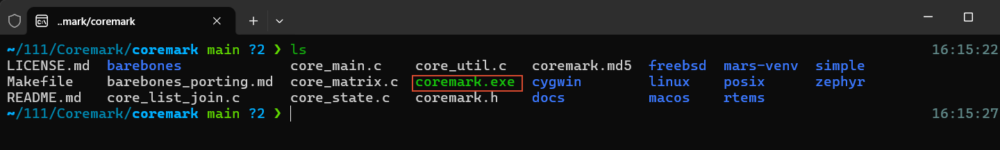
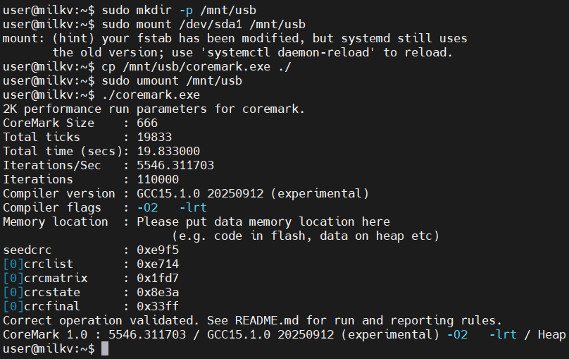

# 在 Milk-V Mars 上运行 CoreMark 基准测试


## 环境说明

- **编译环境**：Windows Subsystem for Linux (WSL) - Ubuntu
- **硬件环境**：Milk-V Mars 开发板 (RISC-V 64)
- **软件环境**：Milk-V 官方 Debian 镜像
- **工具链**：RuyiSDK (使用 gnu-plct 工具链)

---

## 一、 Ruyi 交叉编译环境搭建

#### 更新 Ruyi 索引并安装工具链

在 Ubuntu 终端执行以下命令，确保 Ruyi 索引最新并安装 PLCT 提供的 GNU 工具链：

```bash
ruyi update
ruyi install gnu-plct
```




#### 创建并激活 Ruyi 虚拟环境

使用 `ruyi venv` 创建一个独立的开发环境，确保编译参数与 RISC-V 64 位通用架构匹配。

```bash
# 创建虚拟环境，命名为 mars-venv，使用 generic profile
ruyi venv -t gnu-plct generic mars-venv

# 进入虚拟环境目录
cd mars-venv

# 激活虚拟环境
source ./bin/ruyi-activate
```



#### 验证交叉编译器版本

激活环境后，检查编译器是否已正确指向 Ruyi 虚拟环境中的 RISC-V 编译器：

```bash
riscv64-plct-linux-gnu-gcc --version
```

---

## 二、 获取 CoreMark 源码并编译

### 克隆 CoreMark 源码

在虚拟环境的工作目录下克隆官方仓库：

```bash
# 创建项目文件夹
mkdir -p ~/projects/coremark && cd ~/projects/coremark

# 克隆仓库
git clone [https://github.com/eembc/coremark.git](https://github.com/eembc/coremark.git)
cd coremark
```


### 执行交叉编译

针对 Linux 环境进行编译，并通过 `CC` 参数手动指定 Ruyi 提供的交叉编译器。注意此处只进行编译（compile），不执行运行。

```bash
# 清理旧的编译产物并开始交叉编译
make PORT_DIR=linux CC=riscv64-plct-linux-gnu-gcc compile
```



### 验证编译产物

检查当前目录下是否生成了 `coremark.exe`，并确认其架构信息：

```bash
ls -l coremark.exe
file coremark.exe
```




## 三、 运行 CoreMark 基准测试

将生成的 `coremark.exe` 拷贝至 U 盘并插入 Milk-V Mars 开发板。通过串口终端（如 MobaXterm）登录系统（默认账号：`user`，密码：`milkv`）。

### 挂载 U 盘并准备程序

```bash
# 创建挂载点
sudo mkdir -p /mnt/usb

# 挂载 U 盘（设备名通常为 sda1）
sudo mount /dev/sda1 /mnt/usb

# 拷贝程序至本地并赋予执行权限
cp /mnt/usb/coremark.exe ~/
cd ~/
chmod +x coremark.exe

# 卸载 U 盘
sudo umount /mnt/usb
```

### 执行跑分

运行程序，测试过程大约持续 15-20 秒：

```bash
./coremark.exe
```



---

## 四、 测试结果分析与清理

### 结果参考

在 Milk-V Mars (JH7110) 上，典型的单核 CoreMark 成绩如下：
- **CoreMark 1.0 : 5546.311703**
- **Compiler version : GCC 15.1.0 (experimental)**
- **Compiler flags : -O2**

### 退出 Ruyi 虚拟环境

完成编译任务后，返回编译机终端退出虚拟环境：

```bash
# 退出虚拟环境
deactivate
```
