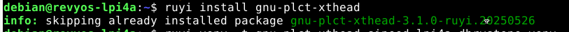
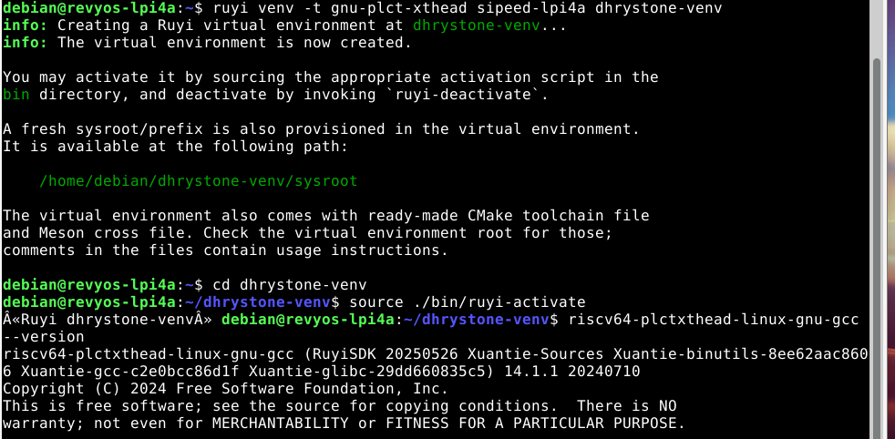
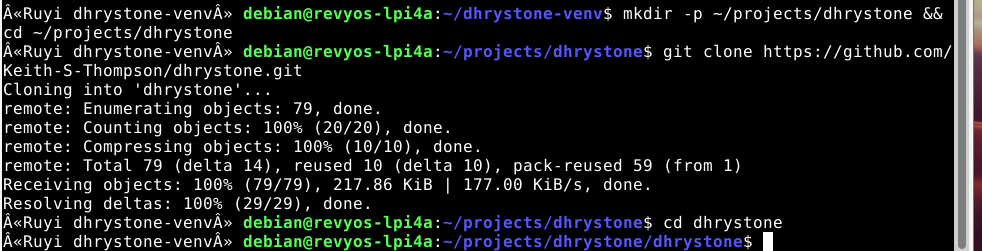
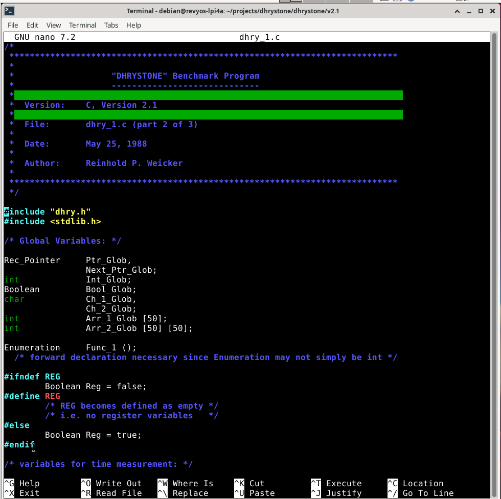
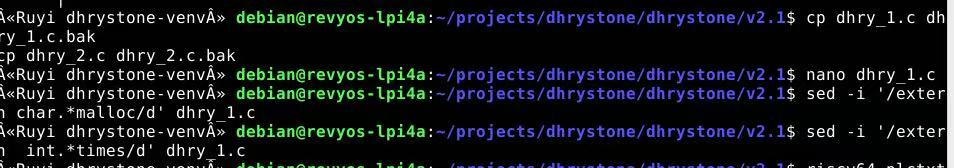
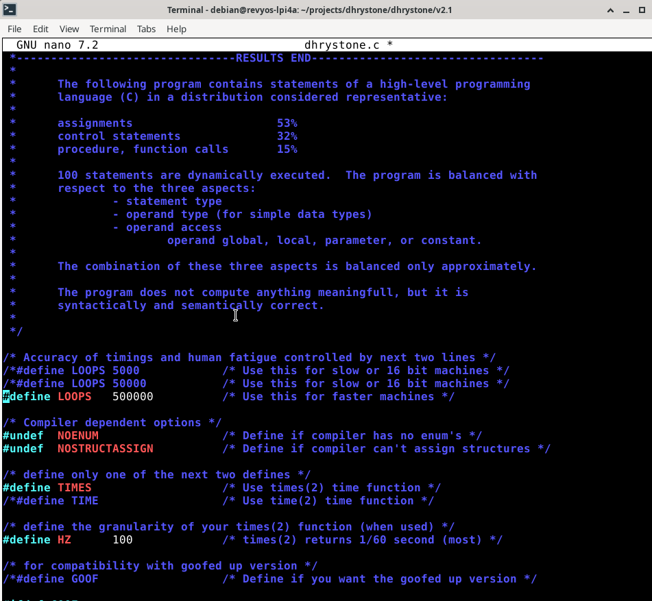
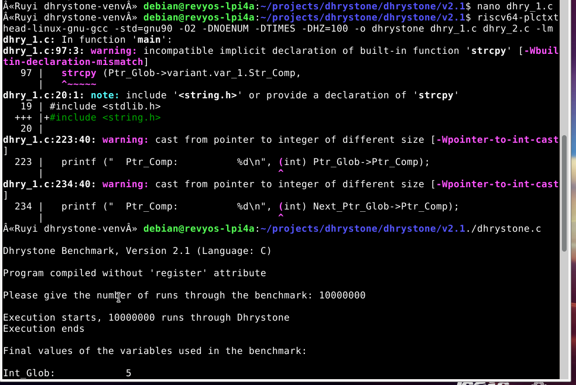
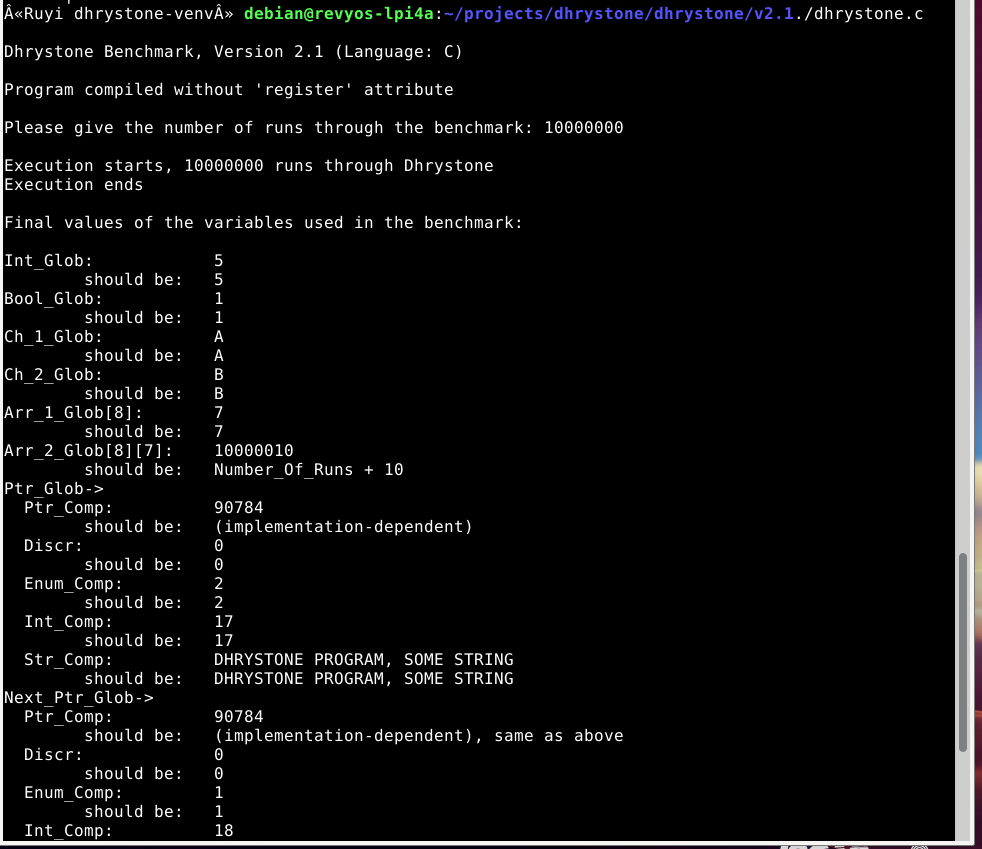
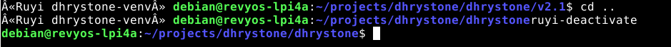

# 在 LicheePi 4A 上运行 Dhrystone 基准测试

## 环境说明

- 硬件环境：Licheepi 4A 开发板（th1520）
- 软件环境：Debian/openEuler for RISC-V

## 一、Ruyi环境搭建

#### 更新 Ruyi 索引并安装工具链

```bash
ruyi update
ruyi install gnu-plct-xthead
```



#### 创建并激活 Ruyi 虚拟环境

```bash
# 创建虚拟环境，命名为 dhrystone-venv，使用 sipeed-lpi4a profile
ruyi venv -t gnu-plct-xthead sipeed-lpi4a dhrystone-venv

# 进入虚拟环境目录
cd dhrystone-venv

# 激活虚拟环境
source ./bin/ruyi-activate
```



#### 验证GCC版本

```bash
riscv64-plctxthead-linux-gnu-gcc --version
make --version
```

## 二、获取  Dhrystone 源码并编译

### 克隆 Dhrystone 源码

```bash
# 创建工作目录（在虚拟环境内）
mkdir -p ~/projects/dhrystone && cd ~/projects/dhrystone

# 克隆仓库
git clone https://github.com/Keith-S-Thompson/dhrystone.git
cd dhrystone
```



### 使用 nano 添加缺失的头文件

```bash
#进入最常用的 v2.1 目录
cd v2.1

#用 nano 打开 dhry_1.c
nano dhry_1.c
```

使用键盘方向键将光标移动到 `#include "dhry.h"` 这一行的**下方**（通常是第 18 行或第 19 行附近）。然后在新的一行中依次输入以下内容：

```c#
#include <stdlib.h>
```

按下 `Ctrl+O` 保存文件（按回车确认文件名），然后按 `Ctrl+X` 退出 nano。

### 删除冲突的旧式函数声明

继续使用 nano 编辑 `dhry_1.c`（或使用 sed 快速删除）。找到包含 `extern char *malloc` 和 `extern int times` 的行，将它们删除或注释掉。也可以使用以下 sed 命令自动删除：

```bash
sed -i '/extern char.*malloc/d' dhry_1.c
sed -i '/extern  int.*times/d' dhry_1.c
```





### 修正重复包含头文件的问题

如果 `dhry_1.c` 中重复包含了 `#include "dhry.h"`（例如第 18 行和第 19 行都是该包含），需删除一行。可用以下命令查看文件开头：

```bash
cat -n dhry_1.c | head -20
```

若发现重复，再次使用 `nano` 打开文件，删除多余的那一行，保存退出。

### 调整循环次数

默认循环次数为 50000，在 TH1520 上运行时间过短，会导致计时为零。建议修改为 500000 以获得数秒的运行时间。用` nano` 打开 `dhry_1.c`，找到 `#define Number_Of_Runs 50000`，将其改为：

```c#
#define Number_Of_Runs 500000
```

按下 `Ctrl+O` 保存文件（按回车确认文件名），然后按 `Ctrl+X` 退出 nano。



### 编译

```bash
riscv64-plctxthead-linux-gnu-gcc -std=gnu90 -O2 -DNOENUM -DTIMES -DHZ=100 -o dhrystone dhry_1.c dhry_2.c -lm
```



## 三、运行 Dhrystone 基准测试

```bash
./dhrystone
```

程序启动后，会提示输入运行的循环次数：

```text
Please give the number of runs through the benchmark:
```

输入一个较大的数字（例如 10000000）并按回车，让测试运行足够长的时间以获得稳定结果。
为了方便自动化测试，也可以使用管道输入：

```bash
echo 10000000 | ./dhrystone
```



### 四、返回上级目录并退出 Ruyi 虚拟环境

```bash
# 返回上级目录
cd ..

# 退出 Ruyi 虚拟环境
ruyi-deactivate
```


