# 使用 cpufetch 查看 RISC-V CPU 信息(基于Licheepi4A)

### 方法一：通过 apt 包管理器安装

RevyOS 官方在 `revyos-addons` 软件源中提供了 riscv64 架构的 cpufetch 预编译包，可直接通过 apt 安装，步骤如下：

#### 确认系统架构

```bash
uname -m
dpkg --print-architecture
```

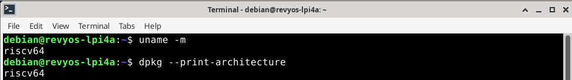

#### 更新软件源

```Bash
sudo apt update
```

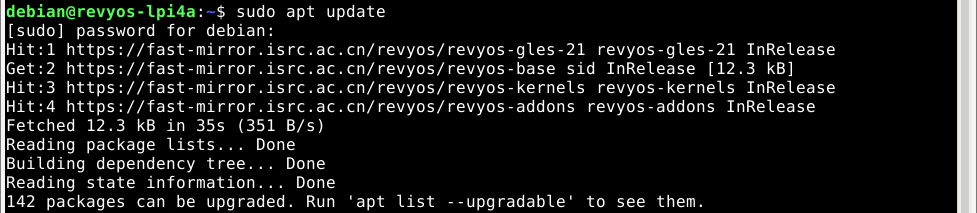

#### 安装 cpufetch 包

```Bash
sudo apt install cpufetch
```

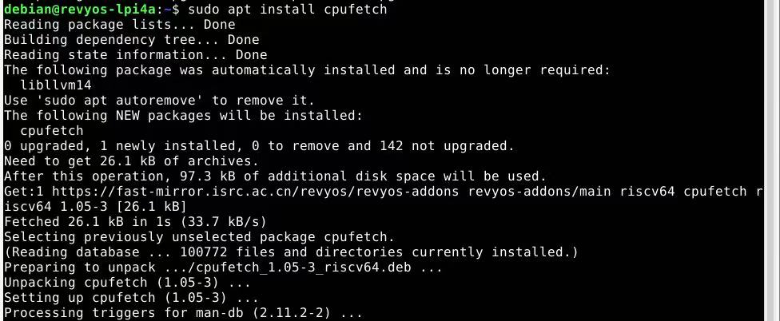

#### 运行程序

```Bash
cpufetch
```

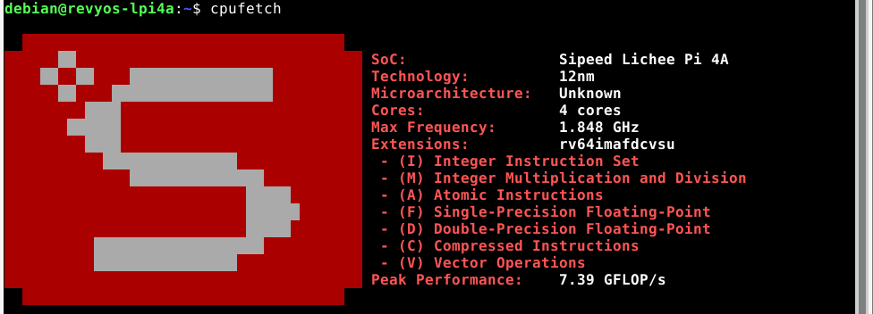

###  方法二：使用 Ruyi 工具链从源码编译安装

若软件源中暂未提供 cpufetch 包，或需自定义代码测试，可从上游仓库编译源码，步骤如下：

#### 更新 Ruyi 索引并安装工具链

```bash
ruyi update
ruyi install gnu-plct-xthead
```


#### 创建并激活 ruyi 虚拟环境

```bash
# 创建虚拟环境，命名为 dhrystone-venv，使用 sipeed-lpi4a profile
ruyi venv -t gnu-plct-xthead sipeed-lpi4a cpufetch-venv

# 进入虚拟环境目录
cd cpufetch-venv

# 激活虚拟环境
source ./bin/ruyi-activate
```

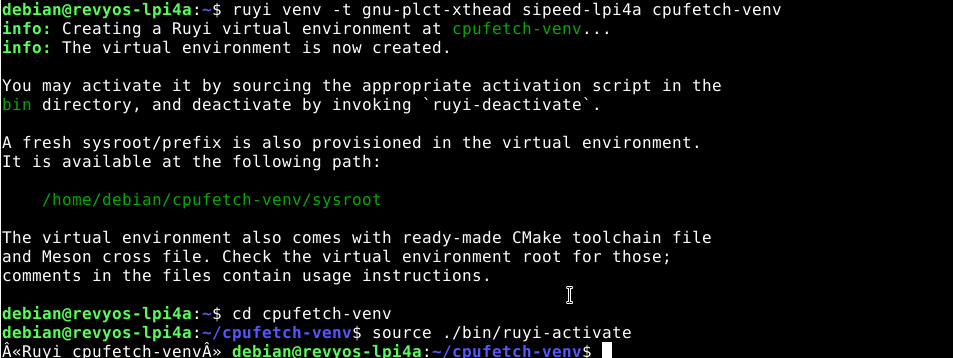

#### 验证GCC版本

```bash
riscv64-plctxthead-linux-gnu-gcc --version
make --version
```

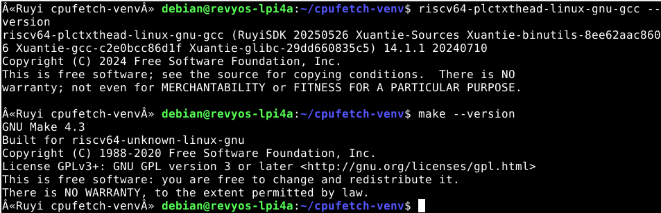

#### 克隆cpufetch源码并编译

```Bash
git clone https://github.com/Dr-Noob/cpufetch.git
cd cpufetch

#直接使用 make 编译（Makefile 会自动检测架构）：
make
```

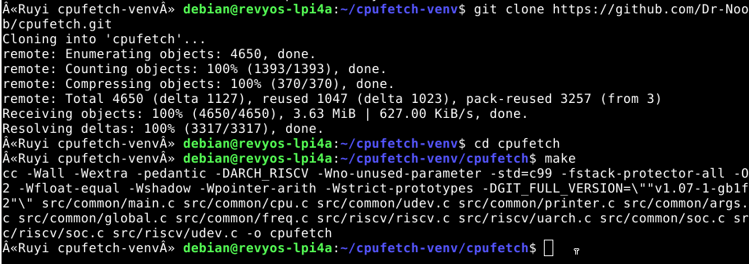

#### 运行本地编译版本

```Bash
./cpufetch
```

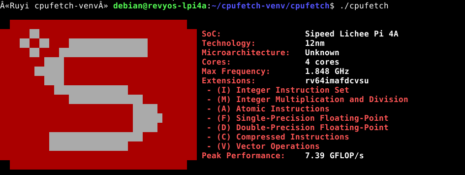

#### 返回上级目录并退出 Ruyi 虚拟环境

```bash
# 返回上级目录
cd ..

# 退出 Ruyi 虚拟环境
ruyi-deactivate
```

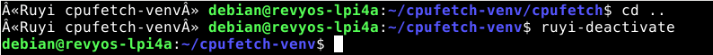

## 进阶用法

cpufetch 支持多种自定义参数，可满足个性化的使用需求，以下为常用进阶用法：

### 1. 自定义配色方案

通过 `--color` 参数修改 Logo 和文字的配色，支持预设配色和自定义 RGB 配色：

1. 使用预设配色（如模拟 ARM 官方默认颜色）：

   ```Bash
   cpufetch --color arm
   ```

   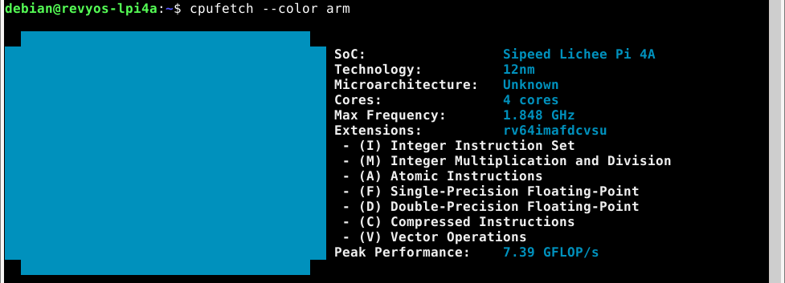

2. 自定义 RGB 配色（格式：`R,G,B:R,G,B:...`，前三个为 Logo 颜色，后两个为文字颜色）：

   ```Bash
   cpufetch --color 239,90,45:210,200,200:0,0,0:100,200,45:0,200,200
   ```

   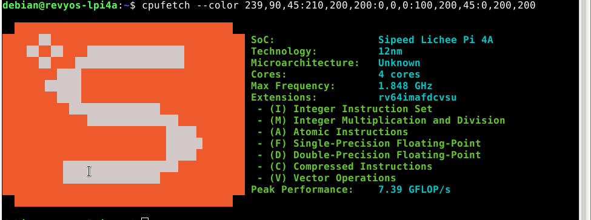

### 2. 切换 Logo 显示风格

通过 `-s`/`--style` 参数切换 Logo 的显示风格，支持 `fancy`（默认）、`retro`（复古）、`legacy`（兼容）三种风格：

```Bash
cpufetch --style retro
```

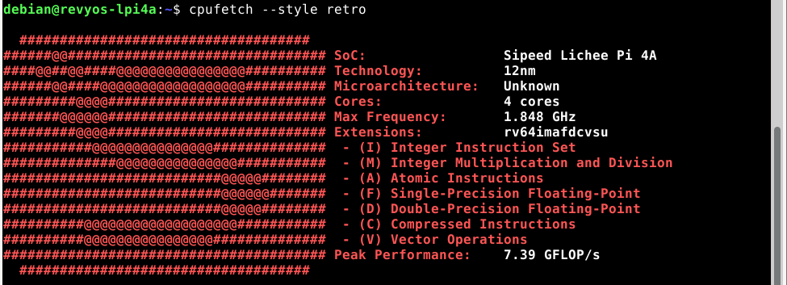

### 3. 显示完整 CPU 名称

默认情况下，cpufetch 会缩写 CPU 名称，通过 `-F`/`--full-cpu-name` 参数可显示全称：

```Bash
cpufetch -F
```

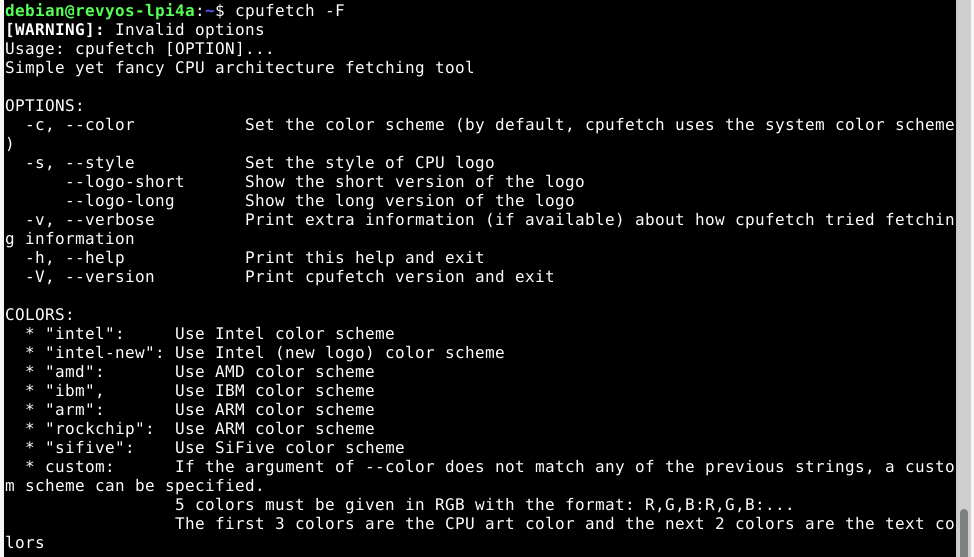
